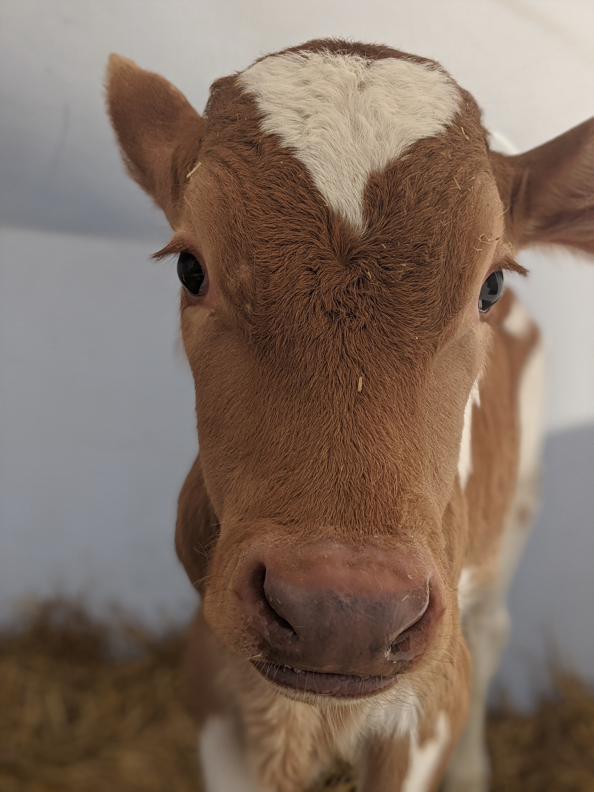

```{r dsetup, results = "hide", echo = FALSE, message = FALSE}
knitr::opts_chunk$set(
  fig.align='center',
  tidy=FALSE,
  comment="R>> ",
  size = 'small'
)
```

## Quick Facts 

<div class = "red3">
 Birthday
</div>

-- April 27

<div class = "red3">
 Hometown
</div>

-- Bridgewater, SD

-- Teeny tiny town halfway between Sioux Falls and Mitchell

-- Named after bridge the hutterite colony had to carry water over into town [originally named Nation (name only lasted 4 whole days)]

<div class = "red3">
 Program of Study
</div>

-- PhD in Ruminant Nutrition

-- What can I say, I really like cows...and alfalfa

## Favorite Animal

<center>
{width=40%}
</center>

-- "I never look at a cow but that I think of her with humility and a feeling of awe and inspiration." -- WD Hoard

## A plot I like
```{r, cars, fig.cap="Scatterplot.", echo=FALSE}
library(ggplot2)
ggplot(cars, aes(speed, dist)) + geom_point()
```

Everyone likes a good scatter plot

## CV Link

[Check it out](https://stat850-unl.github.io/10-presentation-kbuse2/CVBUSE.pdf)
